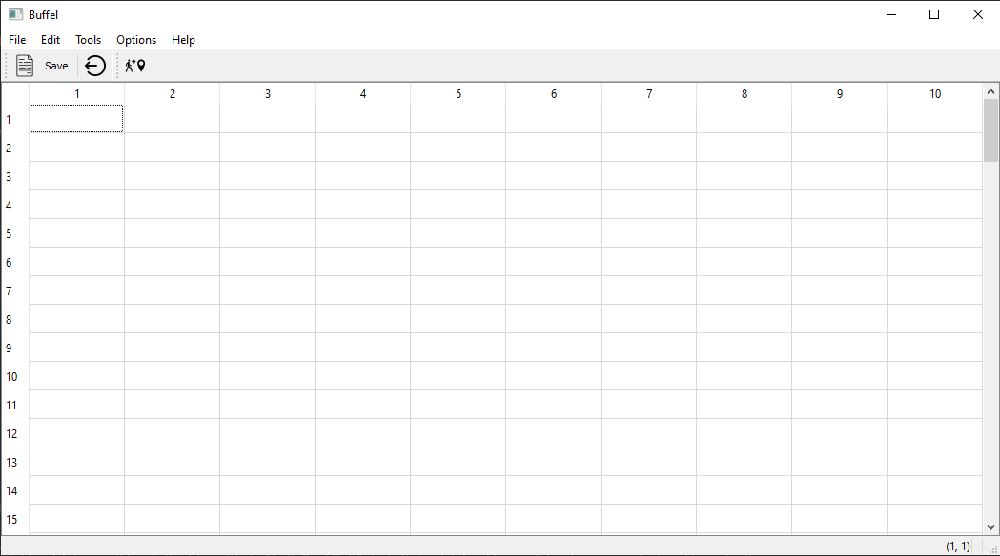
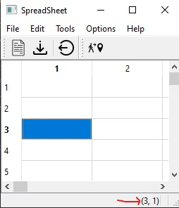

# SpreedSheet

## Introduction

A spreadsheet is a grid composed of an indefinite number of rows and columns that cross to make cells where information is entered. Many people use spreadsheets because of their easy-to-operate functions. Spreadsheets once were known as worksheets used for educational and business purposes only. Today spreadsheets have been discovered also by moms making shopping lists and children creating Christmas wish lists.

## Functionality

Spreadsheets feature columns and rows to keep inserted information legible and simple to understand. You can use spreadsheets to enter data, calculate equations and create charts and graphs. Spreadsheet software has the capability to create a million rows by 16,000 columns, easily enough space to store large databases of text and data.

### **In  our SpreadSheet we have an application with:**

- Menu Bar
- Two tools bars
- Status bar to print the informations

### **the application look like that:**



### **To result with such a functional application you have to go through multiple functions, slots, actions and methods (But don't worry we will explain the functionality and role of each part of our code)** 

# Summary

- [SpreedSheet Header](#spreedsheet-header)
 
   - [Protected Functions](#protected-functions)
 
   - [Private Slots](#private-slots)
 
   - [Pointers](#pointers)
 
 - [SpreedSheet CPP](#spreedsheet-cpp)
 
   - [Functions](#functions)
   
   - [setupMainWidget()](#setupmainwidget)
   
   - [createActions()](#createactions)
   
   - [createMenus()](#createmenus)

   - [createToolBars()](#createtoolbars)
   
   - [updateStatusBar](#updatestatusbar)
   
     - [Example](#example)
     
   - [makeConnexions()](#makeconnexions)
   
   - [Slots implementation](#slots-implementation)
   
     - [cuts](#cuts)
     - [copys](#copys)
     - [pasts](#pasts)
     - [close](#close)
     - [saveContent](#savecontent)
     - [saveSlot](#saveslot)
     - [loadSlot](#loadslot)
     - [openrecent](#openrecent)
     - [goToCellSlot](#gotocellslot)
     - [goFind](#gofind)
     - [loadContent](#loadcontent)
     - [loadcsv](#loadcsv)


 

## SpreedSheet Header

```c++
#ifndef SPREADSHEET_H
#define SPREADSHEET_H

#include <QMainWindow>
#include <QTableWidget>
#include <QAction>
#include <QMenu>
#include <QToolBar>
#include <QLabel>
#include <QStatusBar>

class SpreadSheet : public QMainWindow
{
    Q_OBJECT

public:
    SpreadSheet(QWidget *parent = nullptr);
    ~SpreadSheet();
```

## Protected Functions

```c++
protected:
    void setupMainWidget();
    void createActions();
    void createMenus();
    void createToolBars();
    void makeConnexions();
    void saveContent(QString file) const;
    void loadContent(QString filename) const;
```

## Private Slots

```c++
private slots:
    void close();
    void updateStatusBar(int, int); //Respond for the call changed
    void goToCellSlot();
    void goFind();
    void saveSlot();             //Slot to save the content of the file
//    void openSlot();
    void loadSlot();
 //Pointers
```
## Pointers

```c++
private:
    // --------------- Central Widget -------------//
    QTableWidget *spreadsheet;
    // --------------- Actions       --------------//
    QAction * newFile;
    QAction * open;
    QAction * save;
    QAction * saveAs;
    QAction * exit;
    QAction *cut;
    QAction *copy;
    QAction *paste;
    QAction *deleteAction;
    QAction *find;
    QAction *row;
    QAction *Column;
    QAction *all;
    QAction *goCell;
    QAction *recalculate;
    QAction *sort;
    QAction *showGrid;
    QAction *auto_recalculate;
    QAction *about;
    QAction *aboutQt;
    QString * currentFile;
    // ---------- Menus ----------
    QMenu *FileMenu;
    QMenu *editMenu;
    QMenu *toolsMenu;
    QMenu *optionsMenu;
    QMenu *helpMenu;
    //  ----- - Widget pouyr la bare d'etat
    QLabel *cellLocation;  //position de la cellule active
    QLabel *cellFormula;   // Formuel de la cellule active
};
#endif // SPREADSHEET_H
```
## SpreedSheet CPP

starting with seting spreadsheat **`setupMainWidget()`**, Creaeting Actions **`createActions()`**, Creating the tool bar **`createToolBars()`** and making the connexions **`makeConnexions()`**

```c++
SpreadSheet::SpreadSheet(QWidget *parent)
    : QMainWindow(parent)
{
    //Seting the spreadsheet

    setupMainWidget();

    // Creaeting Actions
    createActions();

    // Creating Menus
    createMenus();


    //Creating the tool bar
    createToolBars();

    //making the connexions
    makeConnexions();
}
```

Creating the labels for the status bar 
```c++
    cellLocation = new QLabel("(1, 1)");
    cellFormula = new QLabel("");
    statusBar()->addPermanentWidget(cellLocation);
    statusBar()->addPermanentWidget(cellFormula);
    currentFile =nullptr;
    setWindowTitle("Buffel");
```
# Functions


Now, let's impliment our previous functions

## **setupMainWidget()**
```c++
void SpreadSheet::setupMainWidget()
{
    spreadsheet = new QTableWidget;
    spreadsheet->setRowCount(100);
    spreadsheet->setColumnCount(20);
    setCentralWidget(spreadsheet);
}
```
## **createActions()**

In this function we create each action using `ExampleAction = new QAction(ExampleIcone, "&New", this)` and we added icons for this actions using `QPixmap newExample(":/new_file.png")` also we can add shortCut using `ExampleFile->setShortcut(tr("Ctrl+ex"))`

```c++
void SpreadSheet::createActions()
{
    // --------- New File -------------------
   QPixmap newIcon(":/new_file.png");
   newFile = new QAction(newIcon, "&New", this);
   newFile->setShortcut(tr("Ctrl+N"));
    // --------- open file -------------------
   QPixmap openIcon(":/open.png");
   open = new QAction(openIcon,"&Open", this);
   open->setShortcut(tr("Ctrl+O"));
    // --------- save file -------------------
   QPixmap saveIcon(":/save.png");
   save = new QAction(saveIcon,"&Save", this);
   save->setShortcut(tr("Ctrl+S"));
    // --------- save file -------------------
    QPixmap saveasIcon(":/saveas.png");
   saveAs = new QAction(saveasIcon,"save &As", this);
    // --------- cut file -------------------
   QPixmap cutIcon(":/cut_icon.png");
   cut = new QAction(cutIcon, "Cu&t", this);
   cut->setShortcut(tr("Ctrl+X"));
   // --------- Copy menu -----------------
   QPixmap copyIcon(":/copy.png");
   copy = new QAction(copyIcon, "&Copy", this);
   copy->setShortcut(tr("Ctrl+C"));
   // --------- paste menu -----------------
   QPixmap pasteIcon(":/paste.png");
   paste = new QAction( pasteIcon,"&Paste", this);
   paste->setShortcut(tr("Ctrl+V"));
   // --------- delete menu -----------------
   QPixmap deleteIcon(":/delete.png");
   deleteAction = new QAction( deleteIcon,"&delete", this);
   deleteAction->setShortcut(tr("Del"));
   // --------- Row , Column -----------------
   row  = new QAction("&Row", this);
   Column = new QAction("&Column", this);
   // --------- all menu -----------------
   all = new QAction("&All", this);
   all->setShortcut(tr("Ctrl+A"));
   // --------- find -----------------
   QPixmap findIcon(":/search_icon.png"); find= new QAction(findIcon, "&Find", this);
   find->setShortcut(tr("Ctrl+F"));
   // --------- goCell -----------------
   QPixmap goCellIcon(":/go_to_icon.png");
   goCell = new QAction( goCellIcon, "&Go to Cell", this);
   deleteAction->setShortcut(tr("f5"));
   // --------- recalculate -----------------
   recalculate = new QAction("&Recalculate",this);
   recalculate->setShortcut(tr("F9"));
 
   sort = new QAction("&Sort");
   
   // --------- showGrid -----------------
   showGrid = new QAction("&Show Grid");
   showGrid->setCheckable(true);
   showGrid->setChecked(spreadsheet->showGrid());
   // --------- auto-recalculate -----------------
   auto_recalculate = new QAction("&Auto-recalculate");
   auto_recalculate->setCheckable(true);
   auto_recalculate->setChecked(true);
   // --------- about -----------------
   about =  new QAction("&About");
   aboutQt = new QAction("About &Qt");
    // --------- exit -------------------
   QPixmap exitIcon(":/quit_icon.png");
   exit = new QAction(exitIcon,"E&xit", this);
   exit->setShortcut(tr("Ctrl+Q"));
}
```
## **createMenus()**

here we add Menu (File,Edit,Toosl,Optins,Help) By using `ExampleMenu = menuBar()->addMenu("&Example");` and in each menu we can add Actions using `ExampleMenu->addAction(Example);`
```c++
void SpreadSheet::createMenus()
{
    // --------  File menu -------//
    FileMenu = menuBar()->addMenu("&File");
    FileMenu->addAction(newFile);
    FileMenu->addAction(open);
    FileMenu->addAction(save);
    FileMenu->addAction(saveAs);
     recent = FileMenu->addMenu("&Recent File");
       FileMenu->addSeparator();
FileMenu->addAction(exit);
    //------------- Edit menu --------/
    editMenu = menuBar()->addMenu("&Edit");
    editMenu->addAction(cut);
    editMenu->addAction(copy);
    editMenu->addAction(paste);
    editMenu->addAction(deleteAction);
    editMenu->addSeparator();
    auto select = editMenu->addMenu("&Select");
    select->addAction(row);
    select->addAction(Column);
    select->addAction(all);
    editMenu->addAction(find);
    editMenu->addAction(goCell);
    //-------------- Toosl menu ------------
    toolsMenu = menuBar()->addMenu("&Tools");
    toolsMenu->addAction(recalculate);
    toolsMenu->addAction(sort);
    //Optins menus
    optionsMenu = menuBar()->addMenu("&Options");
    optionsMenu->addAction(showGrid);
    optionsMenu->addAction(auto_recalculate);
    //----------- Help menu ------------
    helpMenu = menuBar()->addMenu("&Help");
    helpMenu->addAction(about);
    helpMenu->addAction(aboutQt);
}
```
## **createToolBars()**

This functions create a toolBar using `auto toolbar1 = addToolBar("Item")` and we can Add actions to this bar using `toolbar1->addAction(Item)`  However, the toolbar has an advantage as it gives a single click access to any function unlike a menu system where the user has to navigate through sub-menus to ultimate discover the item he is looking for. ; Both provide easy access to commands and functions through easy graphical interface.
```c++
void SpreadSheet::createToolBars()
{
    //Crer une bare d'outils
    auto toolbar1 = addToolBar("File");
    //Ajouter des actions acette bar
    toolbar1->addAction(newFile);
    toolbar1->addAction(save);
    toolbar1->addSeparator();
    toolbar1->addAction(exit);
    //Creer une autre tool bar
    auto toolbar2  = addToolBar("ToolS");
    toolbar2->addAction(goCell);
}
```
## **updateStatusBar**

This function just make an update in the statutbar when you select difrent cell.
```c++
void SpreadSheet::updateStatusBar(int row, int col)
{
    QString cell{"(%0, %1)"};
   cellLocation->setText(cell.arg(row+1).arg(col+1));
}
```
## Example



## **makeConnexions()**

This functions is for connection actions whith their Slots

```c++
void SpreadSheet::makeConnexions()
{
   // --------- Connexion for the  select all action ----/
   connect(all, &QAction::triggered,
           spreadsheet, &QTableWidget::selectAll);
   connect(row, &QAction::triggered,
           spreadsheet, &QTableWidget::selectRow);
   connect(Column, &QAction::triggered,
           spreadsheet, &QTableWidget::selectColumn);
   // Connection for the  show grid
   connect(showGrid, &QAction::triggered,
           spreadsheet, &QTableWidget::setShowGrid);
   //Connection for the exit button
   connect(exit, &QAction::triggered, this, &SpreadSheet::close);
   //connectting the chane of any element in the spreadsheet with the update status bar
   connect(spreadsheet, &QTableWidget::cellClicked, this,  &SpreadSheet::updateStatusBar);
   connect(goCell,&QAction::triggered,this,&SpreadSheet::goToCellSlot);
   connect(find,&QAction::triggered,this,&SpreadSheet::goFind);
   connect(save, &QAction::triggered, this, &SpreadSheet::saveSlot);
   connect(open, &QAction::triggered, this, &SpreadSheet::loadSlot);
   connect(cut, &QAction ::triggered, this, &SpreadSheet::cuts);
   connect(copy, &QAction ::triggered, this, &SpreadSheet::copys);
   connect(paste, &QAction ::triggered, this, &SpreadSheet::pasts);
}
```

## Slots implementation 

- ### cuts
```c++
void SpreadSheet::cuts()
{
    // get the last child widget which has focus and
    // try to cast it as line edit
    QLineEdit* lineEdit = dynamic_cast<QLineEdit*>(focusWidget());
    if (lineEdit)
    {
        // it was a line edit, perform copy
        lineEdit->cut();
    }
}
```

- ### copys
```c++
void SpreadSheet::copys()
{
    // get the last child widget which has focus and
    // try to cast it as line edit
    QLineEdit* lineEdit = dynamic_cast<QLineEdit*>(focusWidget());
    if (lineEdit)
    {
        // it was a line edit, perform copy
        lineEdit->copy();
    }
}
```


- ### pasts
```c++
void SpreadSheet::pasts()
{
    // get the last child widget which has focus and
    // try to cast it as line edit
    QLineEdit* lineEdit = dynamic_cast<QLineEdit*>(focusWidget());
    if (lineEdit)
    {
        // it was a line edit, perform copy
        lineEdit->paste();
    }
}
```


- ### close
```c++
void SpreadSheet::close()
{
    auto reply = QMessageBox::question(this, "Exit",
                                       "Do you really want to quit?");
    if(reply == QMessageBox::Yes)
        qApp->exit();
}
```


- ### saveContent
```c++
void SpreadSheet::saveContent(QString filename) const
{
    //Gettign a pointer on the file
    QFile file(filename);
    //Openign the file
    if(file.open(QIODevice::WriteOnly))  //Opening the file in writing mode
    {
        //Initiating a stream using the file
        QTextStream out(&file);
        //loop to save all the content
        for(int i=0; i < spreadsheet->rowCount();i++)
            for(int j=0; j < spreadsheet->columnCount(); j++)
            {
auto cell =spreadsheet->item(i,j);
                //Cecking if the cell is non empty
                if(cell)
                out << cell->row() << ", "<< cell->column() << ", " << cell->text() << Qt::endl;
            }
    }
    file.close();
}
```


- ### saveSlot
```c++
void SpreadSheet::saveSlot()
{
    //Creating a file dialog to choose a file graphically
    auto dialog = new QFileDialog(this);
    //Check if the current file has a name or not
    if(currentFile == "")
    {
      currentFile = dialog->getSaveFileName(this,"choose your file");
       //Update the window title with the file name
       setWindowTitle(currentFile);
    }
   //If we have a name simply save the content
   if( currentFile != "")
   {
           saveContent(currentFile);
   }
}
```

- ### loadSlot
```c++
void SpreadSheet::loadSlot()
{
    //Creating a file dialog to choose a file graphically
    QFileDialog l ;
    currentFile= l.getOpenFileName();
      setWindowTitle(currentFile);
      if (currentFile.endsWith(".csv"))
      loadcsv(currentFile);
      else loadContent(currentFile);
      if(i<5){
              recentlist.append(new QAction(currentFile,this));
              recent->addAction(recentlist[i]);
              connect(recentlist[i], &QAction::triggered, this, &SpreadSheet::openrecent);
              i++;   }else{
                  for (int j=0;j<4 ;j++ ) {
                      recentlist[4-j]->setText(recentlist[3-j]->text());
                  }
                  recentlist[0]->setText(currentFile);
              }
}
```

- ### openrecent
```c++
void SpreadSheet::openrecent() {
    // obtenir le fichier
auto b = dynamic_cast<QAction*>(sender());
    QFile file(b->text());
    QString line;
     if(file.open(QIODevice::ReadOnly))
     {
         QTextStream in(&file);
         while( !in.atEnd())
         {
             line = in.readLine();
             auto tokens = line.split(QChar(',') );
             int row = tokens[0].toInt();
             int col = tokens[1].toInt();
             spreadsheet->setItem(row, col , new QTableWidgetItem(tokens[2]));
         }
     }
     currentFile = (b->text());
     // mettre a jour le titre de le fenetre
     setWindowTitle(currentFile);
     file.close();
}
```

- ### goToCellSlot
```c++
void SpreadSheet::goToCellSlot(){
//declare dialogue
    gocelldialog D;
    auto repl =D.exec();
 if(repl==gocelldialog::Accepted)
 {
     auto text=D.getText();
     int row =text[0].toLatin1() - 'A';
     text = text.remove(0,1);
     int col = text.toInt()-1;
     spreadsheet->setCurrentCell(row,col);
 }
}
```


- ### goFind
```c++
void SpreadSheet::goFind(){
godialog S;
auto reply=S.exec();
if(reply == godialog::Accepted){
    auto text=S.getText();
    for(auto i =0;i<spreadsheet->rowCount();i++){
        for(auto j =0;j<spreadsheet->columnCount();j++){
          if(spreadsheet-> item(i,j)!=nullptr && spreadsheet-> item(i,j)->text().contains(text) )
              spreadsheet->setCurrentCell( i, j);
       }
    }
  }
}
```

- ### loadContent
```c++
void SpreadSheet::loadContent(QString filename){
    QFile file(filename);
    if (file.open(QIODevice::ReadOnly )) {
        QTextStream in(&file);
       // error message here
    while (!in.atEnd()) {
        QString line = in.readLine();
        // now, line will be a string of the whole line, if you're trying to read a CSV or something, you can split the string
        auto list = line.split(QChar(','));
        // process the line here
        int row =list[0].toInt();
        int  col=list[1].toInt();
       auto contenu=new  QTableWidgetItem (list[2]);
        spreadsheet->setItem(row,col,contenu);
       }
    }
 }
```

- ### loadcsv
```c++
void SpreadSheet::loadcsv(QString filename){
    QFile file(filename);
    if (file.open(QIODevice::ReadOnly )) {
        QTextStream in(&file);
       // error message here
 int i=0;
    while (!in.atEnd()) {
        QString line = in.readLine();
        // now, line will be a string of the whole line, if you're trying to read a CSV or something, you can split the string
        auto list = line.split(QChar(';'));
        // process the line here
        for(int j=0;j<list.length();j++){
            auto contenu=new  QTableWidgetItem (list[j]);
             spreadsheet->setItem(i,j,contenu);
        }
        i++;
    }
  }
}
```
